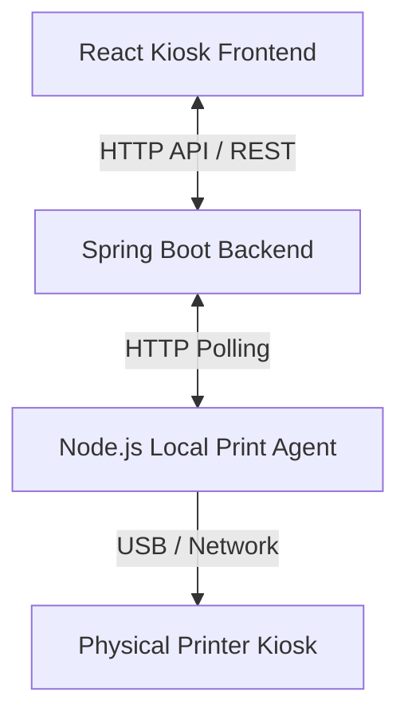

# Cloud Print: Architecture & Project Functionality Blueprint

This document outlines the detailed functionality, directory structure, and module relationships of the Cloud Print system to serve as a blueprint for designing the new 3D Landing Page.

---

## 1. High-Level System Architecture

The project consists of three main systems working in sync:

1. **Frontend (`printe_frontend`)**: The user-facing web interface. Students upload documents and pay. Admins manage printers and view revenue.
2. **Backend (`printer_backend`)**: A Spring Boot application handling business logic, database storage, payments (Razorpay + Wallet), and order queues.
3. **Local Print Agent (`print-agent`)**: A Node.js agent running locally at the printer kiosks. It polls the backend, downloads pending PDFs, and runs OS-level print commands.

---

## 2. Directory Structure

### A. Frontend (`printe_frontend`)
- **`src/components/`**: Core reusable components.
  - `Navbar.jsx`: Multi-tab top navigation.
  - `CustomModal.jsx`: Custom popup dialogs.
  - `QueueCard.jsx` & `PrinterCard.jsx`: Visual status metrics.
- **`src/pages/`**: Primary page screens.
  - `Landing.jsx`: Currently the home page.
  - `BlockSelection.jsx`: Let students select their printer location (block).
  - `Dashboard.jsx`: Central print panel where files are uploaded, configured, and paid.
  - `DisplayPanel.jsx`: Public kiosk monitor screen showing the active/completed queue.
  - `AdminDashboard.jsx`: Admin panel to set pricing, view revenue, and configure printers.
- **`src/services/api.js`**: Axios connection configuration.

### B. Backend (`printer_backend`)
- **`com.saipraveen.login_registration.controller`**:
  - `PdfController.java`: File upload, merge, and order lifecycle.
  - `PaymentController.java`: Razorpay API orders creation and verification.
  - `PricingController.java`: Dynamic price settings by block.
- **`com.saipraveen.login_registration.service`**:
  - `WalletService.java`: Adjust balances, handle refunds and voucher claims.

---

## 3. Key User Flow & Features

1. **Select Kiosk Location**: Users choose their campus block (e.g., "Main Library", "Hostel Block A").
2. **File Processing**: Users upload PDFs or images. The frontend displays the page count and validates it against the live paper sheets remaining in the physical printer.
3. **Settings Configuration**: Customize copies, Black & White vs. Color, duplex printing, and layout scaling (e.g., 2-up, 4-up saving mode).
4. **Direct Payments**:
   - **Prepaid Wallet**: One-click instant checkout using preloaded credits.
   - **UPI / Card**: Razorpay payment gateway integration.
5. **Secure OTP Release**: After payment, the user is given a unique 4-digit OTP. They go to the physical kiosk, enter the OTP, and the agent releases the print job.
